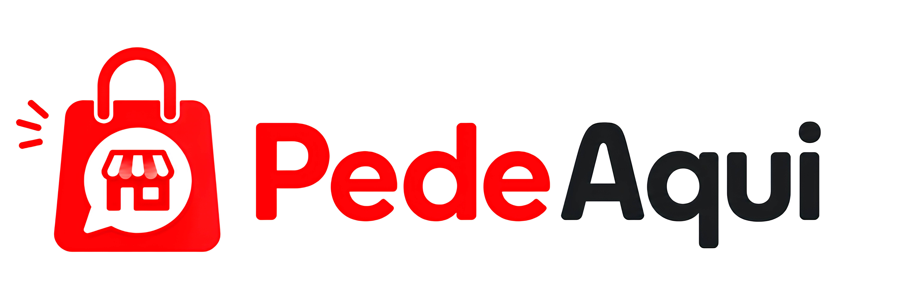
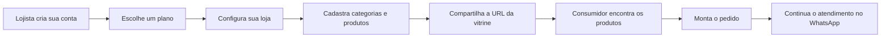
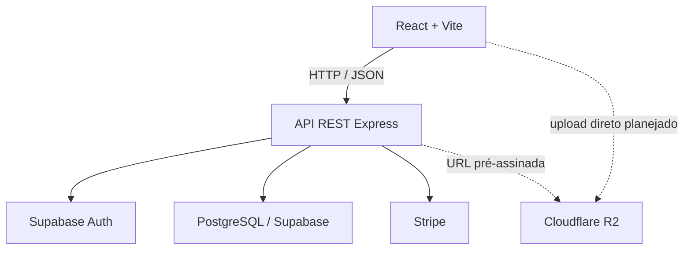

<div align="center">
  

  <h1>PedeAqui</h1>

  <p>
    <strong>Vitrines digitais simples para quem vende. Uma experiência organizada para quem compra.</strong>
  </p>

  <p>
    
    
    
    
    
    
  </p>
</div>

---

## 💡 Sobre o projeto

O **PedeAqui** é uma plataforma SaaS de vitrines digitais criada para pequenos e médios empreendedores que precisam organizar e divulgar seus produtos sem a complexidade de um e-commerce tradicional.

Cada lojista pode criar uma loja com endereço próprio, configurar suas informações comerciais e administrar produtos e categorias. Os consumidores acessam o catálogo por uma URL pública, encontram os itens desejados e podem concluir o contato com o estabelecimento pelo WhatsApp.

O PedeAqui funciona como uma ponte entre exposição digital e atendimento direto: a plataforma organiza a descoberta dos produtos, enquanto negociação, pagamento do pedido e entrega permanecem sob responsabilidade do lojista.

### Proposta de valor

- Presença digital profissional com configuração simples.
- Catálogo centralizado e acessível por link exclusivo.
- Gestão de produtos, categorias, preços e promoções.
- Busca e filtros para facilitar a descoberta de produtos.
- Contato direto entre consumidor e lojista via WhatsApp.
- Modelo SaaS com planos e assinaturas recorrentes.
- Arquitetura multi-tenant, isolando os dados de cada loja.

## 👥 Para quem é o PedeAqui?

- Lojistas locais e pequenos empreendedores.
- Microempresas e negócios em fase de digitalização.
- Comerciantes que usam o WhatsApp como principal canal de atendimento.
- Consumidores que desejam consultar produtos antes de falar com a loja.

## 🔄 Como o sistema funciona



### Jornada do lojista

1. Cria uma conta ou entra com um perfil existente.
2. Escolhe o plano adequado ao seu negócio.
3. Informa identidade, endereço, horários e WhatsApp da loja.
4. Revisa os dados e conclui a criação da vitrine.
5. Gerencia categorias e o catálogo de produtos.
6. Compartilha sua URL exclusiva com os clientes.

### Jornada do consumidor

1. Acessa uma loja pela listagem da plataforma ou pelo link compartilhado.
2. Consulta produtos, preços, promoções e categorias.
3. Pesquisa e filtra o catálogo sem recarregar a página.
4. Seleciona os produtos desejados.
5. Envia o resumo do pedido ao WhatsApp do lojista.

## ✨ Funcionalidades

### Disponíveis na base atual

- Cadastro, login, recuperação de senha, renovação e encerramento de sessão.
- Onboarding do lojista com pré-configuração e revisão da loja.
- Loja vinculada a uma URL exclusiva por `slug`.
- Carregamento e edição dos dados reais da loja.
- CRUD de produtos e categorias.
- Disponibilidade, preço promocional e organização dos produtos.
- Busca textual e filtragem local por categoria na storefront.
- Planos, criação de sessão de checkout e webhook da Stripe no backend.
- Estados de carregamento, sucesso, erro e conteúdo vazio nas jornadas principais.
- Testes unitários e de integração para os principais casos de uso do backend.

### Evolução do produto

- Carrinho completo e finalização do pedido pelo WhatsApp.
- Upload direto de imagens para Cloudflare R2 com URLs pré-assinadas.
- Personalização visual de avatar e banner das lojas.
- Painel administrativo e trilha de auditoria operacional.
- Paginação e filtros avançados no catálogo.
- Monitoramento, métricas da vitrine e histórico de pedidos.

> O roadmap representa a direção do produto. Uma funcionalidade documentada pode ainda estar em implementação ou validação antes de ser disponibilizada em produção.

## 🏗️ Arquitetura

O repositório mantém frontend e backend separados, compartilhando contratos por meio da API REST.



- **Frontend:** arquitetura feature-based/vertical slice, organizada pelos domínios `auth`, `billing`, `orders` e `store`.
- **Backend:** Clean Architecture, com controllers, casos de uso, repositórios, provedores, middlewares e rotas independentes.
- **Banco de dados:** PostgreSQL gerenciado pelo Supabase, com migrations, constraints, triggers, relacionamentos e políticas RLS.
- **Multi-tenancy:** cada lojista é um tenant e possui uma loja; produtos e categorias permanecem vinculados ao mesmo proprietário.
- **Integrações:** Stripe para assinaturas e Cloudflare R2 como estratégia planejada para imagens.

## 🧰 Stack tecnológica

| Camada | Tecnologias |
|---|---|
| Frontend | React 19, TypeScript 6, Vite 8, Tailwind CSS 4 |
| Formulários | React Hook Form, Zod, `@hookform/resolvers` |
| Interface | Framer Motion, Lucide React, design responsivo |
| Backend | Node.js, Express 5, TypeScript, API REST |
| Dados e autenticação | PostgreSQL, Supabase, Supabase Auth, RLS |
| Pagamentos | Stripe Checkout e webhooks |
| Qualidade | Jest, Supertest, ts-jest, ESLint |
| Armazenamento de imagens | Cloudflare R2 com Presigned URLs *(planejado)* |

## 🗂️ Estrutura do repositório

```text
pedeaqui/
├── app/
│   ├── frontend/              # Aplicação React
│   │   ├── public/            # Identidade visual e assets públicos
│   │   └── src/
│   │       ├── app/           # Rotas e composição da aplicação
│   │       ├── features/      # Funcionalidades por domínio
│   │       └── shared/        # Componentes e serviços compartilhados
│   └── backend/               # API REST
│       ├── src/
│       │   ├── controllers/
│       │   ├── useCases/
│       │   ├── repositories/
│       │   ├── infra/
│       │   ├── middlewares/
│       │   └── routes/
│       └── supabase/          # Configuração, migrations e seed
├── docs/                       # Produto, requisitos, arquitetura e processos
└── README.md
```

## 🚀 Executando localmente

### Pré-requisitos

- [Node.js](https://nodejs.org/) `20.19+` ou `22.12+`.
- npm, incluído na instalação do Node.js.
- Um projeto no [Supabase](https://supabase.com/) ou a [Supabase CLI](https://supabase.com/docs/guides/local-development) para ambiente local.
- Uma conta da [Stripe](https://stripe.com/) para testar assinaturas e webhooks.
- [Git](https://git-scm.com/).

### 1. Clone o repositório

```bash
git clone https://github.com/MailsonSousa88/pedeaqui.git
cd pedeaqui
```

### 2. Configure o backend

```bash
cd app/backend
npm install
```

Crie o arquivo `.env` a partir do exemplo:

```bash
cp .env.example .env
```

No PowerShell:

```powershell
Copy-Item .env.example .env
```

Preencha as variáveis:

```dotenv
PORT=3000
SUPABASE_URL=https://seu-projeto.supabase.co
SUPABASE_ANON_KEY=sua-chave-anonima

STRIPE_SECRET_KEY=sk_test_...
STRIPE_WEBHOOK_SECRET=whsec_...
STRIPE_SUCCESS_URL=http://localhost:5173/billing/success
STRIPE_CANCEL_URL=http://localhost:5173/billing/failed
```

> Nunca envie o arquivo `.env` ou credenciais reais para o repositório.

### 3. Prepare o banco de dados

As migrations e o seed estão em [`app/backend/supabase`](app/backend/supabase). Com a Supabase CLI configurada, execute a partir de `app/backend`:

```bash
supabase start
supabase db reset
```

Para utilizar um projeto remoto, vincule o projeto e aplique as migrations seguindo o fluxo oficial da Supabase CLI:

```bash
supabase link --project-ref SEU_PROJECT_REF
supabase db push
```

### 4. Inicie a API

```bash
cd app/backend
npm run dev
```

A API ficará disponível em `http://localhost:3000`. Uma resposta em `GET /` confirma que o servidor está ativo.

Para testar webhooks da Stripe localmente:

```bash
stripe listen --forward-to localhost:3000/api/webhooks/stripe
```

Copie o `whsec_...` fornecido pelo comando para `STRIPE_WEBHOOK_SECRET`.

### 5. Configure e inicie o frontend

Em outro terminal:

```bash
cd app/frontend
npm install
npm run dev
```

Por padrão, o Vite abre a aplicação em `http://localhost:5173` e encaminha as chamadas `/api` para `http://localhost:3000`.

Em ambiente publicado, crie `app/frontend/.env` e defina a URL da API:

```dotenv
VITE_API_URL=https://api.seu-dominio.com
```

## 🧪 Testes e qualidade

### Frontend

```bash
cd app/frontend
npm run lint
npm run build
```

### Backend

```bash
cd app/backend
npm run build
npm test
npm run test:unit
npm run test:integration
npm run test:coverage
```

Os testes de integração exigem um ambiente Supabase configurado. Quando necessário, disponibilize também `SUPABASE_SERVICE_ROLE_KEY` somente no ambiente local ou de CI.

## 🔌 Principais grupos da API

| Prefixo | Responsabilidade |
|---|---|
| `/api/auth` | Cadastro, login, sessão e recuperação de senha |
| `/api/profile` | Dados do perfil autenticado |
| `/api/tenants` | Dados comerciais do lojista |
| `/api/stores` | Criação, edição e consulta das lojas |
| `/api/categories` | Organização das categorias da loja |
| `/api/products` | Produtos, disponibilidade e variações |
| `/api/plans` | Consulta e administração dos planos |
| `/api/subscriptions` | Criação do checkout de assinatura |
| `/api/webhooks/stripe` | Confirmação de eventos enviados pela Stripe |

Rotas privadas exigem o token no cabeçalho:

```http
Authorization: Bearer SEU_ACCESS_TOKEN
```

## 📚 Documentação

- [PRD — Product Requirements Document](docs/product/prd.md)
- [Roadmap](docs/business/roadmap/pruduct-roadmap.md)
- [Requisitos funcionais](docs/requirements/functional/functional-requirements.md)
- [Requisitos não funcionais](docs/requirements/non-functional/non-functional-requirements.md)
- [Diagramas e fluxos Mermaid](docs/diagrams/README.md)
- [Arquitetura e organização do código](docs/architeture/adr/0002-escolha-do-estilo-e-organizacao-de-codigo.md)
- [Stack tecnológica](docs/architeture/adr/0003-definicao-da-stack-tecnologica-do-mvp.md)
- [Arquitetura do banco de dados](app/backend/docs/DATABASE.md)
- [Fluxo de onboarding para testes de API](app/backend/docs/insomnia/shopkeeper-onboarding.md)
- [Termos de Uso](docs/legal/termos-of-use.md)
- [Política de Privacidade](docs/legal/privacy-policy.md)
- [Fluxo de trabalho do time](docs/team/workflow.md)
- [Guia de Pull Requests e Code Review](docs/team/code-review-guidelines.md)

## 🤝 Como contribuir

1. Atualize sua branch `development`.
2. Crie uma branch com escopo claro (`feature/`, `fix/`, `docs/`, `refactor/`, `test/` ou `chore/`).
3. Implemente e valide a alteração.
4. Use commits no padrão `tipo: descrição objetiva`.
5. Abra um Pull Request para `development`.
6. Descreva o objetivo, as alterações e como validar.
7. Solicite a quantidade de revisores exigida pelo [guia de Code Review](docs/team/code-review-guidelines.md).

Consulte também os guias de [branches](docs/team/branch-name-guidelines.md) e [commits](docs/team/commit-message-guidelines.md).

## 👨‍💻 Desenvolvedores

| Responsabilidade | Desenvolvedores |
|---|---|
| Scrum Master | **Mailson Sousa** |
| Dev Frontend | **Mateus Araujo** |
| Dev Frontend | **Cássio Sampaio** |
| Dev Backend | **Vitor Lopes** |
| Dev Backend | **Rikelry Monteiro** |

---

<div align="center">
  <strong>PedeAqui</strong> — sua loja, seus produtos, seu link. 🛒❤️
</div>
