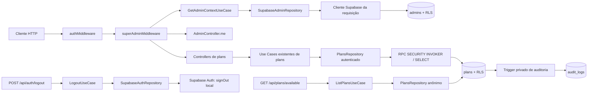
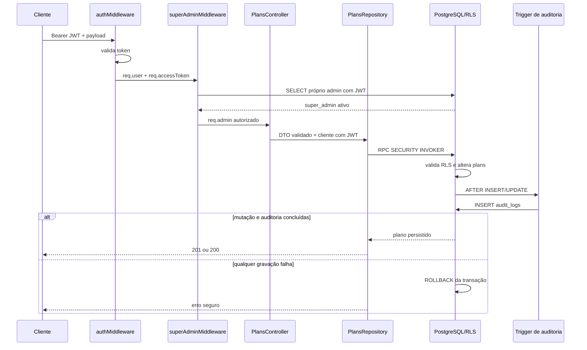

# Acesso Administrativo e Gestão de Planos - Design Backend

**Spec**: `.specs/features/admin-access-plans/spec.md`  
**Status**: Approved  
**Escopo**: `app/backend`  
**ADR relacionado**: `docs/adr/008-autorizacao-admin-auditoria-e-logout-por-sessao.md`  
**Data**: 2026-07-15

---

## 1. Resumo da solução

O backend continuará usando Supabase Auth para provar a identidade do usuário e passará a usar a tabela `admins` como fonte de autorização consultada em toda requisição administrativa. Um novo `superAdminMiddleware`, executado depois de `authMiddleware`, consultará o registro administrativo com um cliente Supabase autenticado pelo Bearer token da própria requisição, exigirá `active = true` e `role = 'super_admin'` e anexará um principal administrativo separado em `req.admin`.

As rotas privadas de planos manterão as URLs atuais, mas criarão `PlansRepository` com o cliente autenticado por requisição. Listagens serão consultas comuns sob RLS; criação e mudança de status usarão funções PostgreSQL `SECURITY INVOKER`, portanto continuarão sujeitas às permissões e policies do chamador. Triggers privados `SECURITY DEFINER` gravarão a auditoria na mesma transação da mutação.

O cliente global com anon key continuará restrito à autenticação, ao endpoint público de planos e a outras operações já públicas. Nenhuma chave `service_role` será adicionada ao runtime normal da API.

## 2. Pesquisa e baseline confirmados

- `authMiddleware` já valida o JWT e preserva `req.accessToken`, mas não consulta `admins` nem distingue tenant de administrador.
- `createAuthenticatedSupabaseClient(accessToken)` já implementa o padrão aceito no ADR 007 e será reutilizado sem alterar emissão, claims ou validação do JWT.
- `PlansRepository` usa hoje o cliente global; seus métodos precisam aceitar um `SupabaseClient` injetado.
- `admin_self_update` permite autoalteração de `role` e `active`; a policy será removida e os privilégios de escrita serão revogados.
- `plans_admin_modify` aceita qualquer admin ativo; será substituída por policies específicas para `super_admin`.
- A tabela `audit_logs` não possui caminho seguro de insert para o usuário autenticado. A atomicidade será implementada por trigger, sem liberar escrita direta.
- O SDK instalado (`@supabase/supabase-js` 2.108.2) impede chamadas a `supabase.auth.*` em clientes criados com a opção `accessToken`. O logout usará `supabase.auth.admin.signOut(accessToken, 'local')`, que envia o JWT recebido ao endpoint de logout sem exigir `service_role`.
- A documentação oficial do Supabase confirma que `scope = 'local'` encerra apenas a sessão atual e que o access token revogado permanece válido até seu `exp`.
- O `CONCERNS.md` está desatualizado quanto às dependências e ao cliente Supabase; código atual, migrations e ADR 007 prevalecem neste design.

Referências técnicas:

- [Supabase - Signing out](https://supabase.com/docs/guides/auth/signout)
- [Supabase - Row Level Security](https://supabase.com/docs/guides/database/postgres/row-level-security)
- [Supabase - Database Functions](https://supabase.com/docs/guides/database/functions)

## 3. Arquitetura



### 3.1 Fronteiras de confiança

1. O JWT válido prova apenas a identidade e produz `req.user` e `req.accessToken`.
2. Somente `GetAdminContextUseCase` transforma essa identidade em um principal administrativo.
3. `req.user.tenantId` permanece por compatibilidade, mas nunca será aceito como evidência de autorização administrativa.
4. A API bloqueia o request antes dos Use Cases de planos; o banco repete a autorização por RLS.
5. O papel é consultado em `admins` a cada requisição, então desativação ou mudança de papel vale imediatamente, sem aguardar refresh do JWT.
6. Somente a função de trigger de auditoria possui privilégio elevado e seu escopo é exclusivamente append em `audit_logs`.

### 3.2 Fluxo de mutação administrativa



## 4. Reuso de código

| Componente existente | Local | Uso no design |
| --- | --- | --- |
| `authMiddleware` | `src/middlewares/authMiddleware.ts` | Continua responsável somente por autenticação e preservação do token |
| Factory autenticada | `src/infra/supabase/supabaseClient.ts` | Cria clientes stateless por request para `admins` e `plans` |
| ADR 007 | `docs/adr/007-rls-cliente-supabase-por-requisicao.md` | Define o padrão de propagação do JWT até o repository |
| `Admin` e `AdminRole` | `src/models/Admin.ts` | Modelam a linha administrativa e validam papéis conhecidos |
| Use Cases de planos | `src/useCases/plans/` | Mantêm regras de preço, unicidade, listagem e status |
| `IPlansRepository` | `src/repositories/IPlansRepository.ts` | Mantém o contrato dos Use Cases; muda apenas a implementação Supabase |
| `PlansRepository` | `src/repositories/supabase/PlansRepository.ts` | Recebe cliente injetado, usa RPCs para mutações e query para leitura |
| Trigger de auditoria de assinatura | migration inicial | Fornece o padrão transacional, endurecido com schema privado e `search_path` fixo |
| `LogoutUseCase` | `src/useCases/auth/LogoutUseCase.ts` | Mantém o contrato e passa o access token ao repository |
| Infra de integração | `src/test-helpers/integrationSetup.ts` | Cria e limpa fixtures somente em Supabase local/teste isolado |
| Coleção Insomnia | `docs/insomnia/` | Padrão para o artefato importável do fluxo administrativo |

## 5. Componentes e interfaces

### 5.1 Tipagem do request e principal administrativo

- **Local**: `src/@types/express/index.d.ts` e `src/middlewares/authMiddleware.ts`
- **Responsabilidade**: definir uma única tipagem para identidade autenticada, token efêmero e principal administrativo.

```typescript
interface AdminPrincipal {
  id: string;
  role: 'super_admin';
  active: true;
}

interface Request {
  accessToken?: string;
  user?: {
    id: string;
    email?: string;
    tenantId: string;
  };
  admin?: AdminPrincipal;
}
```

`accessToken` nunca será serializado, logado ou persistido. `req.admin` só existirá depois da autorização concluída.

### 5.2 `IAdminRepository`

- **Local**: `src/repositories/IAdminRepository.ts`
- **Responsabilidade**: abstrair a leitura do perfil administrativo sem expor Supabase ao Use Case.

```typescript
export interface IAdminRepository {
  findById(id: string): Promise<Admin | null>;
}
```

### 5.3 `SupabaseAdminRepository`

- **Local**: `src/repositories/supabase/SupabaseAdminRepository.ts`
- **Responsabilidade**: ler a linha do próprio usuário com RLS.
- **Dependências**: `SupabaseClient` injetado e model `Admin`.
- **Comportamento**:
  - usar `.maybeSingle()` para distinguir ausência de erro de infraestrutura;
  - mapear row com tipo explícito, sem `any`;
  - rejeitar em runtime papéis desconhecidos, mesmo com constraint no banco;
  - nunca usar o cliente global como fallback em rotas administrativas.

### 5.4 `GetAdminContextUseCase`

- **Local**: `src/useCases/admin/GetAdminContextUseCase.ts`
- **Responsabilidade**: autorizar somente `super_admin` ativo.
- **Interface**:

```typescript
execute(userId: string): Promise<AdminPrincipal>;
```

- **Regras**:
  - linha ausente, inativa ou com outro papel produz o mesmo `ForbiddenError` seguro;
  - falhas do repository não são convertidas em 403; tornam-se erro de infraestrutura e falham fechadas;
  - o Use Case não recebe Express, JWT, email ou `SupabaseClient`.

### 5.5 `superAdminMiddleware`

- **Local**: `src/middlewares/superAdminMiddleware.ts`
- **Responsabilidade**: adaptar o request autenticado para o Use Case de autorização.
- **Ordem obrigatória**: `authMiddleware` -> `superAdminMiddleware` -> controller.
- **Comportamento**:
  - validar a presença interna de `req.user` e `req.accessToken`;
  - criar `SupabaseAdminRepository` com `createAuthenticatedSupabaseClient`;
  - anexar somente o `AdminPrincipal` retornado em `req.admin`;
  - responder 403 com mensagem única para não-admin, inativo e papel não permitido;
  - nunca chamar `next()` quando o acesso for negado.

### 5.6 Endpoint de contexto administrativo

- **Controller**: `src/controllers/admin/AdminController.ts`
- **Route**: `src/routes/admin.routes.ts`
- **Mount**: `app.use('/api/admin', adminRoutes)` em `src/app.ts`.

`GET /api/admin/me` apenas formata os dados já verificados:

```json
{
  "actor": {
    "kind": "admin",
    "id": "uuid",
    "email": "admin@example.com",
    "role": "super_admin",
    "active": true
  }
}
```

O email vem do usuário validado pelo Supabase Auth; o papel e estado vêm de `admins`.

### 5.7 Rotas e controllers de planos

- **Route**: `src/routes/plans.routes.ts`
- **Controllers**: `src/controllers/plans/`
- **Repository**: `src/repositories/supabase/PlansRepository.ts`

As rotas ficam organizadas assim:

```text
GET    /available       -> público, sem middleware administrativo
POST   /                -> authMiddleware -> superAdminMiddleware -> CreatePlanController
GET    /                -> authMiddleware -> superAdminMiddleware -> ListPlansController
PATCH  /:id/status      -> authMiddleware -> superAdminMiddleware -> UpdatePlanStatusController
```

Nos handlers privados, o controller cria `PlansRepository` e Use Case por request com o cliente autenticado. O handler público continua usando o repository com cliente anônimo.

Validações HTTP:

- `active` na query aceita somente as strings `true` e `false`;
- `active` no body deve ser boolean real, sem `Boolean(value)`;
- `priceBrlCents` deve ser inteiro seguro maior que zero;
- `name` deve ser string não vazia;
- `stripePriceId` deve ser string não vazia, `null` ou ausente;
- `active` ausente na criação normaliza para `true` e `stripePriceId` ausente para `null`.

O precheck de `findByStripeId` pode continuar para uma mensagem antecipada, mas a constraint unique permanece a autoridade contra corrida.

### 5.8 Erros de aplicação e resposta HTTP

- **Novos componentes**: `src/errors/ApplicationError.ts` e `src/utils/httpErrorResponse.ts`.
- **Objetivo**: distinguir validação, acesso negado, não encontrado e conflito sem acoplar Use Cases a Express.

| Categoria interna | HTTP | Payload público |
| --- | ---: | --- |
| autenticação ausente/inválida | 401 | `{ error: true, message, code: 401 }` |
| autorização administrativa negada / SQLSTATE `42501` | 403 | `{ error: true, message, code: 403 }` |
| payload ou query inválida | 400 | `{ error: true, message, code: 400 }` |
| plano não encontrado | 404 | `{ error: true, message, code: 404 }` |
| constraint `plans_stripe_price_id_key` / conflito detectado | 409 | `{ error: true, message, code: 409 }` |
| falha inesperada, inclusive auditoria | 500 | `{ error: true, message: "Erro interno", code: 500 }` |

Mensagens do Supabase, SQL, tokens e detalhes de existência administrativa não serão devolvidos ao cliente. Logs internos serão sanitizados e não conterão credenciais.

### 5.9 Logout por sessão

- **Local alterado**: `src/repositories/supabase/SupabaseAuthRepository.ts`
- **Contrato preservado**: `IAuthRepository.signOut(accessToken)` e `LogoutUseCase`.
- **Implementação**:

```typescript
supabase.auth.admin.signOut(accessToken, 'local');
```

O método usa o JWT fornecido para revogar a sessão atual. Não utiliza `createAuthenticatedSupabaseClient`, pois o SDK bloqueia `auth.*` quando esse cliente é configurado com a opção `accessToken`. Também não utiliza `service_role`.

O refresh token daquela sessão deixa de ser reutilizável. O access token já emitido pode continuar aceito até expirar, comportamento que será documentado e testado.

## 6. Design do banco de dados

Uma migration aditiva será criada em `supabase/migrations/`. Ela não reescreverá a migration inicial.

### 6.1 `admins`

1. Verificar previamente se existem papéis fora de `super_admin`, `support` e `finance`; a migration falha fechada se encontrar dados inválidos.
2. Adicionar `CHECK (role IN ('super_admin', 'support', 'finance'))`.
3. Remover `admin_self_update`.
4. Manter apenas leitura própria para `authenticated`:

```sql
USING (id = (SELECT auth.uid()))
```

5. Revogar `INSERT`, `UPDATE` e `DELETE` de `anon` e `authenticated`.
6. Não criar CRUD de administradores ou policy de escrita nesta entrega.

O bootstrap remoto verifica `tenants` antes de criar `admins`. A API nunca interpreta `tenantId` como papel administrativo.

### 6.2 Helper de autorização

Será criado `private.is_active_super_admin()` como função `STABLE SECURITY DEFINER`, com `SET search_path = ''` e referências totalmente qualificadas. Ela consulta `public.admins` por `(SELECT auth.uid())`, `active = true` e `role = 'super_admin'`.

O schema `private` não será exposto no Data API. A função terá apenas o privilégio necessário para ser usada pelas policies do papel `authenticated`.

### 6.3 Policies e privilégios de `plans`

As policies genéricas atuais serão substituídas por capacidades explícitas:

| Policy | Comando | Papel | Predicado |
| --- | --- | --- | --- |
| `plans_public_read` | SELECT | `anon`, `authenticated` | `active = true` |
| `plans_super_admin_read` | SELECT | `authenticated` | `private.is_active_super_admin()` |
| `plans_super_admin_insert` | INSERT | `authenticated` | `WITH CHECK private.is_active_super_admin()` |
| `plans_super_admin_update` | UPDATE | `authenticated` | `USING` e `WITH CHECK private.is_active_super_admin()` |

Não haverá policy nem grant de delete. Os privilégios serão reduzidos para:

- `SELECT` para `anon` e `authenticated`;
- `INSERT (name, price_brl_cents, stripe_price_id, active)` para `authenticated`;
- `UPDATE (active)` para `authenticated`;
- nenhum outro privilégio de escrita para os papéis do Data API.

O grant por coluna impede alterações diretas de `id`, preço, Stripe ID ou timestamps por uma chamada de status.

### 6.4 RPCs de mutação

As funções ficarão no schema `public` para uso via PostgREST, mas serão `SECURITY INVOKER`, com `SET search_path = ''`, execução revogada de `PUBLIC`/`anon` e concedida somente a `authenticated`.

```sql
public.admin_create_plan(
  p_name text,
  p_price_brl_cents bigint,
  p_stripe_price_id text DEFAULT NULL,
  p_active boolean DEFAULT true
) RETURNS SETOF public.plans
```

- executa um único `INSERT ... RETURNING`;
- preserva RLS e grants do JWT chamador;
- a unique constraint de `stripe_price_id` resolve concorrência.

```sql
public.admin_set_plan_status(
  p_plan_id uuid,
  p_active boolean
) RETURNS SETOF public.plans
```

- obtém o plano com `SELECT ... FOR UPDATE`;
- retorna zero linhas quando o plano não existe;
- retorna a linha sem `UPDATE` quando o status já é o solicitado;
- atualiza somente `active` quando há transição real.

Cada chamada RPC executa em uma transação PostgreSQL. Nenhuma função de mutação será `SECURITY DEFINER`.

### 6.5 Auditoria atômica

Uma função `private.fn_audit_plan_mutation()` será criada como `SECURITY DEFINER`, `SET search_path = ''`, com execução direta revogada de `PUBLIC`, `anon` e `authenticated`. Dois triggers a chamarão:

- `AFTER INSERT ON public.plans` -> `plan.create`;
- `AFTER UPDATE OF active ON public.plans`:
  - `true -> false` -> `plan.deactivate`;
  - `false -> true` -> `plan.update`;
  - sem mudança efetiva -> nenhum log.

Para requests com `auth.uid()` presente, a função confirma novamente que o ator é `super_admin` ativo e grava `admin_id = auth.uid()`. Se uma operação privilegiada de migration/manutenção não tiver `auth.uid()`, o evento poderá ser registrado com `admin_id = null` e `actor_kind = 'system'` no payload; isso não cria um caminho de runtime, pois a aplicação não possui `service_role`.

Payload mínimo:

```typescript
type PlanCreateAuditPayload = {
  name: string;
  price_brl_cents: number;
  stripe_price_id: string | null;
  active: boolean;
};

type PlanStatusAuditPayload = {
  old_active: boolean;
  new_active: boolean;
};
```

O `INSERT` em `audit_logs` acontece dentro da mesma transação. Falha do trigger desfaz a mutação; falha da mutação impede o trigger de confirmar.

### 6.6 Acesso a `audit_logs`

- remover `audit_log_self_read` nesta fatia;
- revogar `SELECT`, `INSERT`, `UPDATE` e `DELETE` de `anon` e `authenticated`;
- manter RLS habilitado;
- não criar endpoint de consulta;
- permitir leitura apenas ao cliente privilegiado da infraestrutura de teste, nunca ao runtime comum.

## 7. Provisionamento

### 7.1 Ambiente local

`supabase/seed.sql` receberá uma fixture de desenvolvimento com o mesmo UUID em:

1. `auth.users` e `auth.identities`;
2. `profiles` com nome e telefone de teste;
3. `admins` com `role = 'super_admin'` e `active = true`.

As credenciais serão claramente marcadas como locais. O runbook explicará que `supabase db reset` aplica o seed local, enquanto `supabase db push` remoto aplica migrations e não deve provisionar a fixture.

### 7.2 Ambiente remoto

Será criado `docs/runbooks/provision-super-admin.md` com procedimento operacional:

1. criar o usuário no Supabase Auth por console administrativo;
2. iniciar transação SQL;
3. localizar o UUID pelo email e falhar se for ambíguo ou inexistente;
4. falhar se existir `tenants.id = user_id`;
5. criar ou validar `profiles.id = user_id`;
6. inserir `admins.id = user_id`, `role = 'super_admin'`, `active = true`;
7. confirmar IDs e commit;
8. autenticar pela API e validar `GET /api/admin/me`.

Não haverá endpoint, convite ou script runtime com chave privilegiada.

## 8. Estratégia de testes

### 8.1 Unitários

| Alvo | Cenários mínimos |
| --- | --- |
| `GetAdminContextUseCase` | super-admin ativo; sem linha; inativo; support; finance; erro de repository |
| `superAdminMiddleware` | pré-condição ausente; 403 genérico; principal anexado; `next` não chamado na negação |
| `AdminController` | contrato `actor`; invariante de principal ausente |
| Controllers de plans | query estrita; body boolean; defaults; 400/404/409/500 padronizados |
| Use Cases de plans | regras existentes preservadas e conflitos tipados |
| Repositories | mapeamento de rows/RPC, `23505`, `42501`, ausência e falha de infraestrutura |
| Logout | o token recebido é passado a `auth.admin.signOut` com scope `local`; falha é propagada |

Cada Use Case criado ou alterado deverá manter cobertura mínima de 95% em statements, branches, functions e lines.

### 8.2 Integração HTTP e RLS

Fixtures isoladas: `super_admin`, tenant comum, admin inativo, `support` e `finance`.

Casos obrigatórios:

1. `/api/admin/me` retorna 200 somente para `super_admin` ativo, 401 para token inválido e 403 genérico para os demais.
2. As três rotas privadas de planos recusam todos os atores não autorizados antes do Use Case.
3. `/api/plans/available` continua anônimo e nunca lista inativos.
4. Cliente autenticado não altera o próprio `admins.role` nem `admins.active` diretamente.
5. Create gera exatamente um `plan.create` com o admin correto.
6. Desativar e reativar geram a ação correta; repetir o mesmo status não cria evento.
7. Dois creates concorrentes com o mesmo Stripe ID resultam em um 201, um 409, um plano e um audit.
8. Falhas de validação ou unicidade não geram audit bem-sucedido.
9. Uma falha de insert em `audit_logs`, provocada em teste SQL transacional isolado e revertido, desfaz a mutação do plano.
10. Logout impede refresh da sessão encerrada, enquanto o access token pode funcionar até expirar.

O helper privilegiado de testes poderá criar fixtures, ler audit e limpar dados, mas deverá abortar se a URL não for explicitamente local ou de teste. Nunca será executado contra produção.

### 8.3 Gate de verificação

```bash
npx jest src/useCases/admin src/useCases/plans src/middlewares --runInBand
npm run test:integration -- --runInBand
npm run test:coverage -- --runInBand
npm run build
```

Antes da execução, será necessário confirmar explicitamente a consolidação da fatia `admin-access-plans`, pois ela exige testes HTTP/RLS e `STATE.md` ainda lista plans como módulo deferido.

## 9. Documentação operacional

- `docs/runbooks/provision-super-admin.md`: bootstrap local e remoto, verificação e rollback operacional.
- `docs/insomnia/admin-access-plans.insomnia.json`: login, `/admin/me`, list/create/status, available, logout e refresh negativo pós-logout.
- `docs/insomnia/admin-access-plans.md`: ordem de execução, variáveis, atores esperados e resultados 200/201/400/401/403/404/409.
- Nenhum arquivo conterá credencial de ambiente remoto.

## 10. Decisões técnicas

| Decisão | Escolha | Motivo |
| --- | --- | --- |
| Fonte de autorização | tabela `admins` por request | revogação imediata e ausência de claims obsoletas |
| Papel desta fatia | somente `super_admin` ativo | contrato já aprovado; menor superfície inicial |
| Contexto de dados | cliente Supabase por request | aplica RLS com o mesmo JWT validado pela API |
| Mutação de planos | RPC `SECURITY INVOKER` | transação explícita e idempotência sem bypass de RLS |
| Auditoria | trigger privado `SECURITY DEFINER` | atomicidade sem grant de insert em `audit_logs` |
| Policies | uma por capacidade | evita `FOR ALL` amplo e separa público de administrativo |
| Logout | `auth.admin.signOut(token, 'local')` | revoga somente a sessão representada pelo token |
| Bootstrap | seed local + runbook remoto | reproduzível sem expor cadastro administrativo na API |
| URLs | preservar `/api/plans` | compatibilidade com consumidores existentes |
| `service_role` | somente helper isolado de teste | proibido no runtime comum; necessário apenas para fixtures/cleanup |

### 10.1 Gate de ADR

O ADR 008 é obrigatório antes da implementação porque o logout passa a efetivamente revogar a sessão indicada pelo JWT e porque o design introduz uma função privilegiada de auditoria. A implementação deverá parar se houver proposta de:

- custom claims ou Auth Hooks;
- `service_role` no runtime normal;
- RPC de mutação `SECURITY DEFINER`;
- autorização baseada em `tenantId`;
- mudança das URLs públicas aprovadas.

## 11. Riscos e mitigação

| Risco | Mitigação |
| --- | --- |
| Migration encontra papel administrativo inválido | preflight falha fechado; corrigir dados antes de validar constraint |
| Middleware é aplicado na ordem errada | testes de route/middleware e declaração explícita por rota |
| Repository usa cliente global por engano | construtor injetável e ausência de fallback nos handlers privados |
| RLS permite papel não previsto | helper exige `active` e `role = 'super_admin'`; integração cobre support/finance |
| Auditoria parcial | trigger na mesma transação e teste de rollback |
| Mensagem vaza estado de admin | 403 único para ausente, inativo e papel incorreto |
| Logout encerra todas as sessões | scope fixo `local`, não o default `global` |
| Access token é reutilizado após logout | comportamento documentado; expiração JWT curta permanece controle operacional |
| Testes atingem banco remoto indevido | guard explícito de URL e credenciais apenas de ambiente local/teste |
| Policy pública expõe plano inativo | policy separada `active = true` e teste anônimo |

## 12. Rastreabilidade

| Requisito | Componentes de design | Verificação principal |
| --- | --- | --- |
| ADM-BE-01 | `GetAdminContextUseCase`, middleware, `/api/admin/me` | integração 200 e contrato `actor` |
| ADM-BE-02 | `authMiddleware`, resposta HTTP comum | testes 401 sem consulta admin |
| ADM-BE-03 | Use Case + 403 genérico | fixtures comum/inativo/support/finance |
| ADM-BE-04 | ordem dos middlewares + policies de plans | matriz de atores nas três rotas |
| ADM-BE-05 | factory e repositories injetados | integração RLS com JWT real |
| ADM-BE-06 | handler anônimo + `plans_public_read` | available público sem inativos |
| ADM-BE-07 | parser estrito + `findAll` autenticado | filtros true/false/ausente/inválido |
| ADM-BE-08 | Create Use Case + RPC + unique constraint | preço, 409 e corrida concorrente |
| ADM-BE-09 | validação booleana + RPC com lock | 200, 400, 404 e idempotência |
| ADM-BE-10 | remoção de policy e revogação de grants | tentativa direta de autoalteração |
| ADM-BE-11 | CHECK + validação runtime de `AdminRole` | migration e teste de row inválida |
| ADM-BE-12 | trigger transacional de auditoria | exatamente um evento e rollback |
| ADM-BE-13 | seed local + runbook remoto | bootstrap e rejeição de tenant existente |
| ADM-BE-14 | logout local com JWT recebido | refresh token não reutilizável |
| ADM-BE-15 | erros tipados + mapper HTTP | payloads 400/401/403/404/409/500 |
| ADM-BE-16 | interfaces, DI e suites de teste | build, cobertura e integração isolada |

**Cobertura de design**: 16 de 16 requisitos mapeados.

## 13. Gate da fase Design

Este design e o ADR 008 precisam de aprovação antes da criação de `tasks.md`. A aprovação para executar a feature também deverá confirmar explicitamente a consolidação do módulo `admin-access-plans`, habilitando os testes HTTP/RLS definidos nesta arquitetura.
