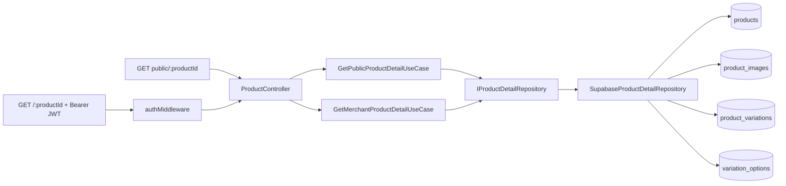

# Product Detail Design

**Spec:** `.specs/features/product-detail/spec.md`
**Status:** Implemented / Manual validation pending

## Architecture Overview

O detalhe sera uma projecao de leitura propria, sem ampliar `IProductRepository`, que hoje representa apenas o CRUD da entidade `Product`. O novo repositorio compoe produto, imagens, variacoes e opcoes em consultas em lote, sem N+1, e entrega um DTO de leitura ja seguro para serializacao HTTP.



O controller mantem a adaptacao HTTP. Os Use Cases so conhecem `IProductDetailRepository`; as regras de filtro e a composicao do agregado ficam na implementacao Supabase. Nenhuma entidade de escrita e reutilizada como resposta, evitando vazar `r2Key`, `sizeBytes` ou `mimeType` de `ProductImage`.

## Code Reuse Analysis

| Reuso | Local | Uso no design |
| --- | --- | --- |
| Registro de produto publico/privado | `src/routes/product.routes.ts` | Registrar a rota publica antes de `authMiddleware` e a privada depois dele. |
| Adaptacao de erros | `src/controllers/product/ProductController.ts` | Converter `Not Found` em `404` e preservar o padrao de respostas. |
| Ownership de produto | `ToggleProductAvailabilityUseCase` | Detalhe privado usa o mesmo efeito: recurso ausente ou de outro tenant retorna `404`. |
| Estrutura de variacoes/opcoes | `ProductVariation` e `VariationOption` | Projetar `label`, `sortOrder`, `value` e `priceModifierCents` no agregado. |
| Politica publica de produto | migration inicial, `storefront_public_products` | Reproduzir integralmente a elegibilidade para as tabelas filhas. |

## Components and Interfaces

### Read DTOs

**Location:** `src/dtos/ProductDetailDTO.ts`

```typescript
interface ProductDetailImage {
  id: string;
  url: string;
  sortOrder: number;
}

interface ProductDetailOption {
  id: string;
  value: string;
  priceModifierCents: number;
  sortOrder: number;
}

interface ProductDetailVariation {
  id: string;
  label: string;
  sortOrder: number;
  options: ProductDetailOption[];
}

interface ProductDetail {
  id: string;
  storeId: string;
  categoryId: string;
  name: string;
  description: string | null;
  priceCents: number;
  promoPriceCents: number | null;
  promoEndsAt: Date | null;
  details: Record<string, unknown>;
  available: boolean;
  images: ProductDetailImage[];
  variations: ProductDetailVariation[];
  createdAt: Date;
  updatedAt: Date;
}
```

O DTO nao contem `tenantId`, `deletedAt`, `r2Key`, `sizeBytes` ou `mimeType`. `categoryId` permanece obrigatorio porque a migration posterior torna `products.category_id` `NOT NULL`.

### Repository Contract

**Location:** `src/repositories/IProductDetailRepository.ts`

```typescript
interface IProductDetailRepository {
  findPublicById(productId: string): Promise<ProductDetail | null>;
  findByIdForTenant(productId: string, tenantId: string): Promise<ProductDetail | null>;
}
```

**Implementation:** `src/repositories/supabase/SupabaseProductDetailRepository.ts`.

- Busca o produto por id e monta o agregado com quatro consultas em lote: produto, imagens, variacoes e opcoes para todos os ids de variacao retornados.
- Ordena imagens, variacoes e opcoes por `sort_order` e, em empate, por `id`, garantindo ordem estavel.
- Mapeia snake_case para camelCase e inicializa todos os arrays, inclusive quando nao houver filhos.
- No metodo publico, filtra `id`, `available = true` e `deleted_at IS NULL`; RLS completa a verificacao de tenant e loja ativos.
- No metodo privado, filtra `id`, `tenant_id` e `deleted_at IS NULL`; produto indisponivel continua elegivel para o proprietario.

### Use Cases

**Locations:**

- `src/useCases/product/GetPublicProductDetailUseCase.ts`
- `src/useCases/product/GetMerchantProductDetailUseCase.ts`

Ambos recebem somente `IProductDetailRepository`. O publico chama `findPublicById(productId)`; o privado chama `findByIdForTenant(productId, tenantId)`. Se o repositorio devolver `null`, lancam `Not Found: Product not found`. Eles nao importam Express nem Supabase.

### HTTP Adapter and Client Scope

`ProductController` ganha `getPublicDetail` e `getPrivateDetail`.

- `getPublicDetail` usa uma instancia anonima de `SupabaseProductDetailRepository`.
- `getPrivateDetail` usa o JWT ja validado por `authMiddleware` para criar uma instancia Supabase exclusiva da requisicao, configurada com `accessToken` e sem persistir sessao/renovar token. O controller injeta essa instancia no repositorio e passa somente `req.user!.id` ao Use Case.
- O middleware passa a reter o bearer token validado somente durante o ciclo da requisicao, para a criacao do cliente privado. Nenhuma regra de emissao, validacao ou formato do JWT e alterada.

Rotas finais:

```text
GET /api/products/public/:productId  -> getPublicDetail   (antes de authMiddleware)
GET /api/products/:productId         -> getPrivateDetail  (depois de authMiddleware)
```

`/public/:productId` deve ser registrada antes de `/:productId`, evitando colisao de parametros.

## RLS and Migration

O cliente Supabase atual usa `anonKey`. Portanto, a consulta publica nao consegue ler hoje `product_variations` e `variation_options`, que possuem apenas policies para `authenticated`; uma migration e obrigatoria antes de expor o endpoint.

A migration devera:

1. Substituir `storefront_public_images` por uma policy que permita leitura anonima/autenticada somente quando o produto estiver `available`, nao removido, em tenant ativo e em loja ativa.
2. Criar `SELECT` publico para `product_variations` sob exatamente a mesma elegibilidade do produto pai.
3. Criar `SELECT` publico para `variation_options` apenas quando sua variacao pertencer a produto com exatamente a mesma elegibilidade.

As policies usam `EXISTS` com `products`, `tenants` e `stores`; nao concedem escrita publica. A policy antiga de imagens deve ser removida, nao apenas complementada, porque policies permissivas de `SELECT` se combinam por `OR`.

Para o detalhe privado, o cliente por requisicao propaga o JWT do lojista ao Supabase e permite que as policies de ownership existentes sejam aplicadas. Nao sera introduzida chave `service_role` nem novo segredo de ambiente.

## Error Handling Strategy

| Scenario | Use Case / HTTP behavior |
| --- | --- |
| Produto publico ausente, indisponivel, removido ou inelegivel | repositorio retorna `null`; controller responde `404`. |
| Produto privado ausente, removido ou de outro tenant | repositorio retorna `null`; controller responde `404`. |
| Token ausente ou invalido na rota privada | `authMiddleware` responde `401` antes do controller. |
| Falha Supabase inesperada | repositorio propaga erro; controller responde `400` conforme padrao atual e registra a causa quando houver logging disponivel. |

## Testing Strategy

- Criar testes unitarios dos dois Use Cases com `IProductDetailRepository` mockado: sucesso, retorno `null`, indisponibilidade publica e ownership privado.
- Testar o mapeamento/ordem no repositorio por meio dos testes de integracao do contrato quando a infraestrutura isolada estiver disponivel; os Use Cases nao acessam Supabase real.
- Adicionar requests Insomnia para o detalhe publico e privado, incluindo o fluxo de produto indisponivel e o toggle existente.
- Gate de Use Cases: `npx jest --testMatch '**/src/useCases/**/*.spec.ts' --testPathIgnorePatterns='\\.integration\\.spec\\.ts$' --coverage --runInBand`; gate final: `npm run build` e `npm test`.

## Tech Decisions

| Decision | Choice | Rationale |
| --- | --- | --- |
| Forma da leitura | Novo repositorio de projecao | Evita poluir o CRUD de `Product` e evita N+1 no Use Case. |
| Estrategia de agregacao | Consultas em lote por tabela filha | Mantem ordenacao deterministica e evita depender de relacoes aninhadas implicitamente nomeadas pelo PostgREST. |
| Autorizacao publica | RLS explicita nas tres tabelas filhas | O cliente anonimo ja esta em uso; sem isso variacoes/opcoes nao chegam ao payload. |
| Autorizacao privada | Cliente Supabase por requisicao com JWT validado | Preserva RLS e ownership sem service role e sem estado global compartilhado. |
| Imagens sem registros | `images: []` | Permite placeholder no frontend sem bifurcar o contrato. |
