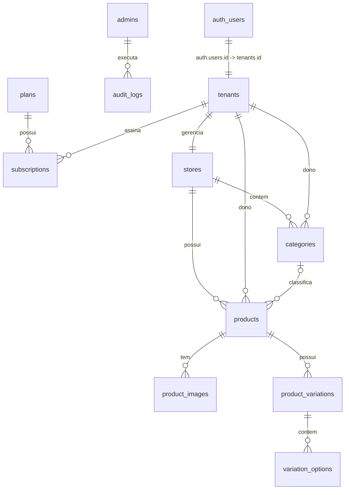

# Arquitetura do Banco de Dados - PedeAqui

Este documento descreve o modelo de dados, o mini mundo e os relacionamentos das tabelas configuradas no Supabase para o projeto **PedeAqui**.

---

## 1. Descrição do Mini Mundo (Regras de Negócio)

O **PedeAqui.store** é uma plataforma SaaS (Software as a Service) multi-tenant voltada para vitrines digitais de pequenos e médios lojistas. O fluxo e as regras fundamentais do negócio são:

1. **Multi-Tenancy & Assinaturas**:
   - Cada lojista é um **Tenant** (`tenants`), cujo identificador único mapeia diretamente para o usuário autenticado (`auth.users.id`).
   - O tenant possui um limite de armazenamento de fotos em bytes (`photo_storage_limit`) e um status (`active`, `suspended`).
   - Os tenants escolhem e assinam um **Plano** (`plans`). A cobrança e a gestão de planos ocorrem por meio de IDs de preço integrados ao Stripe.
   - A relação entre um tenant e um plano é definida na tabela **Assinaturas** (`subscriptions`). O status da assinatura pode ser `active`, `past_due`, `unpaid` ou `canceled`.

2. **Lojas (Vitrines)**:
   - Cada tenant possui exatamente uma **Loja** (`stores`), que é sua vitrine pública.
   - A loja possui um link exclusivo (`slug`), nome, descrição opcional, link do logotipo e número do WhatsApp para contato e finalização das vendas.

3. **Catálogo de Produtos**:
   - A loja organiza seus itens em **Categorias** (`categories`), ordenadas por um peso (`sort_order`).
   - Os **Produtos** (`products`) pertencem a uma loja, a um tenant e, opcionalmente, a uma categoria.
   - Cada produto tem um preço base (`price_cents`) e pode ter um preço promocional ativo (`promo_price_cents`) com data de encerramento (`promo_ends_at`).
   - Um produto pode ter várias **Imagens** (`product_images`) ordenadas.
   - Os produtos também podem apresentar **Variações** (`product_variations`, ex: "Cor", "Tamanho") e cada variação possui várias **Opções** (`variation_options`, ex: "Preto", "Branco", "G", "M").

4. **Painel de Controle & Auditoria**:
   - Administradores do sistema (`admins`) gerenciam a plataforma com papéis definidos (`super_admin`, `support`, `finance`).
   - Qualquer alteração crítica de plano, suspensão de tenant ou criação de administradores é registrada na tabela de **Logs de Auditoria** (`audit_logs`) para conformidade e segurança.

---

## 2. Diagrama de Entidade-Relacionamento (ERD)

### 2.1 Diagrama Visual em Caracteres (ASCII)

```text
                                  +------------+
                                  | auth.users |
                                  +-----+------+
                                        |
                                      (1:1)
                                        v
+----------+                      +------------+              +-------+
|  admins  |                      |  tenants   |              | plans |
+----+-----+                      +--+---+--+--+              +---+---+
     |                               |   |  |                     |
   (1:N)         +-------------------+   |  +----------+        (1:N)
     v           | (1:1)                 |             |          v
+------------+   v                     (1:N)         (1:N)  +------------+
| audit_logs | +----------+              |             +--->|subscriptions|
+------------+ |  stores  |              v                  +------------+
               +----+-----+        +------------+
                    |              | categories |
                  (1:N)            +-----+------+
                    v                    |
             +------------+<-------------+ (1:N)
             |  products  |
             +--+------+--+
                |      |
              (1:N)  (1:N)
                v      v
+----------------+    +--------------------+
| product_images |    | product_variations |
+----------------+    +--------+-----------+
                               |
                             (1:N)
                               v
                      +-------------------+
                      | variation_options |
                      +-------------------+
```

### 2.2 Diagrama Mermaid




---

## 3. Estrutura das Tabelas (Esquema Físico)

### 3.1 `admins`
Responsável por armazenar os administradores da plataforma.
- `id` (UUID, PK): Chave primária, referência direta ao `auth.users.id`.
- `name` (VARCHAR): Nome completo do administrador.
- `role` (ENUM): Papel do administrador (`super_admin`, `support`, `finance`). Default: `support`.
- `active` (BOOLEAN): Estado do cadastro. Default: `true`.
- `created_at` / `updated_at` (TIMESTAMPTZ): Registro de data de criação e atualização.

### 3.2 `audit_logs`
Histórico de ações críticas realizadas por administradores.
- `id` (UUID, PK): Identificador gerado automaticamente.
- `admin_id` (UUID, FK): Aponta para `admins.id`.
- `action` (ENUM): Ação auditada (ex: `tenant.suspend`, `plan.create`, etc.).
- `target_table` (VARCHAR): Tabela afetada.
- `target_id` (UUID): ID do registro modificado.
- `payload` (JSONB): Objeto com o estado da modificação. Default: `{}`.
- `created_at` (TIMESTAMPTZ): Data e hora do log.

### 3.3 `plans`
Planos disponíveis para assinatura.
- `id` (UUID, PK): Identificador gerado automaticamente.
- `name` (VARCHAR): Nome comercial do plano.
- `price_brl_cents` (BIGINT): Preço em centavos de BRL (ex: `9990` para R$ 99,90).
- `stripe_price_id` (VARCHAR, UNIQUE, NULL): Identificador correspondente no Stripe.
- `active` (BOOLEAN): Define se o plano pode ser assinado por novos usuários. Default: `true`.
- `created_at` / `updated_at` (TIMESTAMPTZ): Datas de criação e atualização.

### 3.4 `tenants`
Clientes comerciais da plataforma que possuem lojas.
- `id` (UUID, PK): ID único vinculado ao `auth.users.id`.
- `name` (VARCHAR): Nome do lojista.
- `status` (VARCHAR): Estado operacional (`active`, `suspended`). Default: `active`.
- `cpf_cnpj` (VARCHAR, UNIQUE): Documento de identificação.
- `photo_storage_limit` (BIGINT): Limite de arquivos de imagens em bytes.
- `stripe_customer_id` (VARCHAR, UNIQUE, NULL): Código do cliente no Stripe.
- `created_at` / `updated_at` (TIMESTAMPTZ): Datas de criação e atualização.

### 3.5 `subscriptions`
Contratos ativos de cobrança dos Tenants.
- `id` (UUID, PK): Chave primária.
- `tenant_id` (UUID, FK): Aponta para `tenants.id`.
- `plan_id` (UUID, FK): Aponta para `plans.id`.
- `status` (VARCHAR): Situação do pagamento (`active`, `past_due`, `unpaid`, `canceled`). Default: `active`.
- `stripe_subscription_id` (VARCHAR, UNIQUE, NULL): ID da assinatura no Stripe.
- `starts_at` / `ends_at` (TIMESTAMPTZ): Período de vigência da assinatura.
- `created_at` / `updated_at` (TIMESTAMPTZ): Datas de criação e atualização.

### 3.6 `stores`
Vitrines digitais configuradas por cada tenant.
- `id` (UUID, PK): Chave primária.
- `tenant_id` (UUID, FK, UNIQUE): Vinculado a `tenants.id` (Relação 1-para-1).
- `slug` (VARCHAR, UNIQUE): Endereço amigável da loja (ex: `minha-loja`).
- `store_name` (VARCHAR, UNIQUE): Nome de exibição da loja.
- `horario_abertura` (TIME): Horário de abertura da loja.
- `horario_fechamento` (TIME): Horário de fechamento da loja.
- `endereco` (TEXT): Endereço da loja.
- `descricao` (TEXT, NULL): Descrição curta ou slogan.
- `logo_url` (VARCHAR, NULL): URL da imagem do logotipo.
- `whatsapp_number` (VARCHAR, UNIQUE): Número do celular com DDI para redirecionamento.
- `active` (BOOLEAN): Status de exibição pública. Default: `true`.
- `deleted_at` (TIMESTAMPTZ, NULL): Data de exclusão lógica (Soft Delete).
- `created_at` / `updated_at` (TIMESTAMPTZ): Datas de criação e atualização.

### 3.7 `categories`
Categorias de organização de produtos das lojas.
- `id` (UUID, PK): Chave primária.
- `store_id` (UUID, FK): Aponta para `stores.id`.
- `tenant_id` (UUID, FK): Aponta para `tenants.id`.
- `name` (VARCHAR): Nome da categoria.
- `description` (TEXT, NULL): Detalhes complementares.
- `sort_order` (INTEGER): Peso de ordenação. Default: `0`.
- `deleted_at` (TIMESTAMPTZ, NULL): Exclusão lógica.
- `created_at` / `updated_at` (TIMESTAMPTZ): Datas de criação e atualização.

### 3.8 `products`
Catálogo de itens comercializados pelas lojas.
- `id` (UUID, PK): Chave primária.
- `store_id` (UUID, FK): Aponta para `stores.id`.
- `tenant_id` (UUID, FK): Aponta para `tenants.id`.
- `category_id` (UUID, FK, NULL): Aponta para `categories.id`.
- `name` (VARCHAR): Nome comercial do produto.
- `description` (TEXT, NULL): Ficha técnica ou descrição do produto.
- `price_cents` (BIGINT): Preço original do produto em centavos.
- `promo_price_cents` (BIGINT, NULL): Preço em centavos com desconto ativo.
- `promo_ends_at` (TIMESTAMPTZ, NULL): Data e hora limite para expiração da promoção.
- `details` (JSONB): Detalhes flexíveis de especificações do item. Default: `{}`.
- `available` (BOOLEAN): Flag de disponibilidade em estoque. Default: `true`.
- `deleted_at` (TIMESTAMPTZ, NULL): Exclusão lógica.
- `created_at` / `updated_at` (TIMESTAMPTZ): Datas de criação e atualização.

### 3.9 `product_images`
Fotos de exibição cadastradas para o produto.
- `id` (UUID, PK): Chave primária.
- `product_id` (UUID, FK): Aponta para `products.id`.
- `r2_key` (VARCHAR, UNIQUE): Caminho do arquivo no bucket R2.
- `url` (VARCHAR, UNIQUE): URL absoluta da imagem armazenada no bucket.
- `size_bytes` (BIGINT): Tamanho do arquivo em bytes.
- `mime_type` (VARCHAR): Tipo MIME da imagem.
- `sort_order` (INTEGER): Ordem de exibição na galeria do produto. Default: `0`.
- `created_at` (TIMESTAMPTZ): Data de upload.

### 3.10 `product_variations`
Variações estruturais de um produto (ex: "Cor", "Tamanho").
- `id` (UUID, PK): Chave primária.
- `product_id` (UUID, FK): Aponta para `products.id`.
- `label` (VARCHAR): Título da variação.
- `sort_order` (INTEGER): Ordem de exibição. Default: `0`.
- `created_at` (TIMESTAMPTZ): Registro de criação.

### 3.11 `variation_options`
Opções selecionáveis vinculadas a uma variação (ex: "Preto", "M").
- `id` (UUID, PK): Chave primária.
- `variation_id` (UUID, FK): Aponta para `product_variations.id`.
- `value` (VARCHAR): Valor textual da opção de variação.
- `price_modifier_cents` (BIGINT): Valor adicionado ao price_cents do produto. Default: `0`.
- `sort_order` (INTEGER): Ordem de listagem das opções. Default: `0`.
- `created_at` (TIMESTAMPTZ): Registro de criação.
