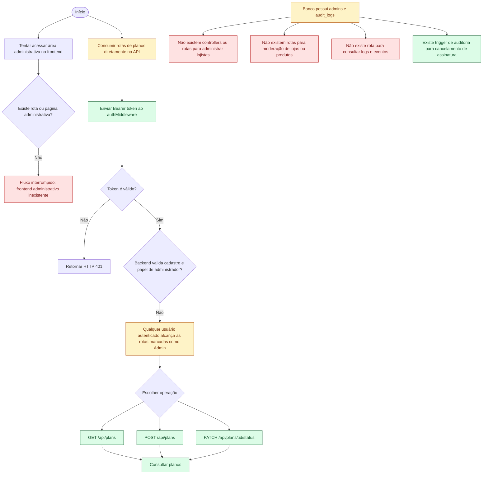

# Fluxo atual do administrador

## Escopo

Este diagrama registra o estado atual do ator administrador. O banco possui entidades para administradores e auditoria, e o backend possui operações de planos marcadas como administrativas. Entretanto, ainda não existe uma jornada administrativa completa ou segura conectada ao frontend.

## Limites atuais representados

- Não há rota, tela, menu ou dashboard administrativo no frontend.
- As rotas de gestão de planos exigem autenticação, mas não verificam a tabela `admins` nem o papel `super_admin`, `support` ou `finance`.
- Não há API para listar, suspender ou reativar tenants.
- Não há API administrativa para moderar lojas ou produtos.
- Não há API para consultar `audit_logs` ou logs de acesso.
- A existência dos modelos `Admin` e `AuditLog` não constitui, sozinha, um fluxo administrativo implementado.
