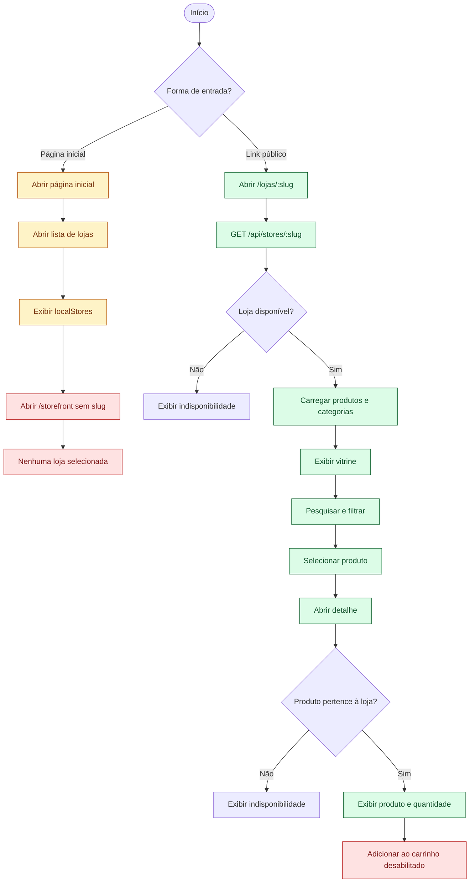
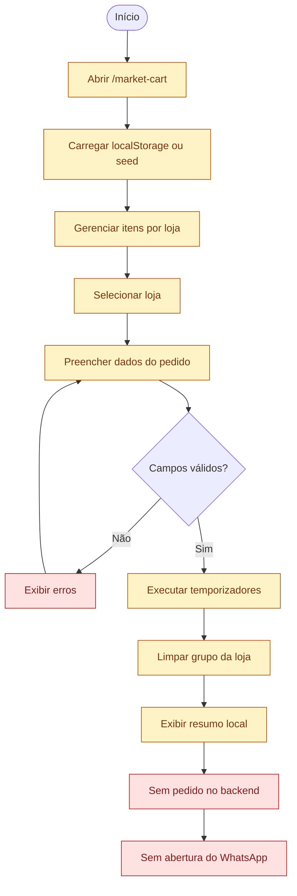

# Fluxo atual do consumidor

## Escopo

Os diagramas descrevem somente o que o consumidor consegue executar no frontend atual. O ator não precisa de conta. A vitrine pública por slug está conectada ao backend, enquanto a listagem geral, a inclusão no carrinho e a finalização pelo WhatsApp ainda possuem limitações explícitas.

## Descoberta da loja e visualização do produto

## Carrinho e finalização atual

## Limites atuais representados

- `GET /api/stores/public` existe no backend, mas a página geral de lojas ainda recebe `localStores` do frontend.
- A vitrine e o detalhe do produto funcionam quando o consumidor possui um slug válido.
- O detalhe do produto não adiciona itens ao carrinho porque a ação está desabilitada.
- O carrinho inicia com dados demonstrativos quando não encontra dados locais.
- O checkout usa apenas validação e temporizadores no navegador.
- Não existe rota de pedido no backend nem redirecionamento atual para `wa.me`.
