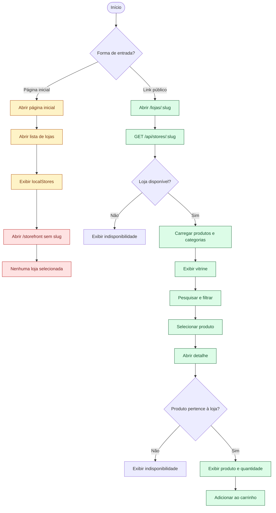
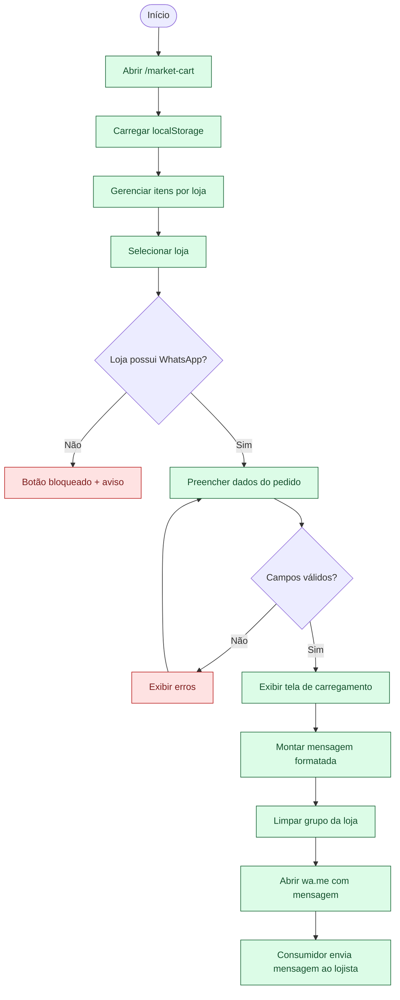

# Fluxo atual do consumidor

## Escopo

Os diagramas descrevem somente o que o consumidor consegue executar no frontend atual. O ator não precisa de conta. A vitrine pública por slug está conectada ao backend, enquanto a listagem geral, a inclusão no carrinho e a finalização pelo WhatsApp ainda possuem limitações explícitas.

## Descoberta da loja e visualização do produto

## Carrinho e finalização atual

## Limites atuais representados

- `GET /api/stores/public` existe no backend, mas a página geral de lojas ainda recebe `localStores` do frontend.
- A vitrine e o detalhe do produto funcionam quando o consumidor possui um slug válido.
- O detalhe do produto adiciona itens ao carrinho via localStorage.
- O carrinho inicia vazio quando não encontra dados locais.
- O checkout usa validação Zod e temporizadores visuais no navegador.
- Ao confirmar, o sistema monta a mensagem, limpa o carrinho da loja e abre `wa.me` com a mensagem pré-formatada.
- O PedeAqui não envia mensagens em nome do consumidor nem confirma que a mensagem foi enviada.
- Lojas sem WhatsApp cadastrado não permitem finalização do pedido.

