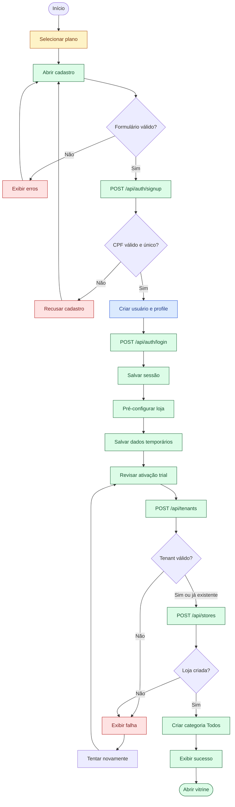
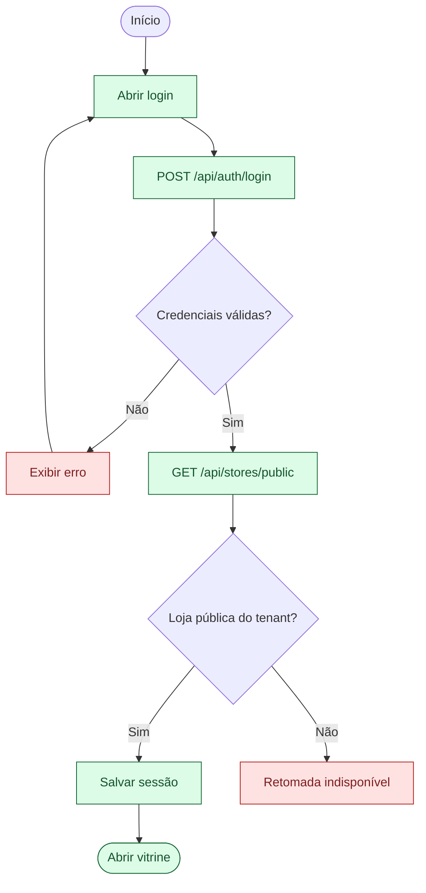

# Fluxo atual do lojista

## Escopo

Os diagramas abaixo representam o fluxo disponível atualmente para cadastro, autenticação, criação da loja e gestão básica do catálogo. O fluxo pago do Stripe existe no backend, mas não está conectado à jornada atual do frontend; a ativação da loja utiliza o trial criado junto ao tenant.

## Cadastro e criação da loja



## Login do lojista



## Gestão da loja e do catálogo

```mermaid
flowchart TD
    storefront(["Vitrine por slug"]) --> loadData["Carregar loja e catálogo"]
    loadData --> owner{"Sessão pertence ao tenant?"}
    owner -->|Não| publicView["Exibir visão pública"]
    owner -->|Sim| action{"Escolher gestão"]
    action --> editStore["Editar loja"]
    action --> products["Gerenciar produtos"]
    action --> categories["Gerenciar categorias"]
    editStore --> updateStore["PUT /api/stores/:id"]
    products --> productCrud["CRUD e disponibilidade"]
    categories --> categoryCrud["Editar ou excluir"]
    updateStore --> refresh["Atualizar catálogo"]
    productCrud --> refresh
    categoryCrud --> refresh
    refresh --> storefront

    variations["API de variações"] -.-> noVariationUi["Sem integração no formulário"]
    stripe["API Stripe Checkout"] -.-> noStripeUi["Sem chamada no frontend"]

    classDef integrated fill:#dcfce7,stroke:#166534,color:#14532d;
    classDef partial fill:#fef3c7,stroke:#b45309,color:#78350f;
    classDef blocked fill:#fee2e2,stroke:#b91c1c,color:#7f1d1d;

    class storefront,loadData,publicView,editStore,products,categories,updateStore,productCrud,categoryCrud,refresh integrated;
    class variations,stripe partial;
    class noVariationUi,noStripeUi blocked;
```

## Limites atuais representados

- O plano selecionado no frontend é guardado localmente, mas não participa da criação do trial.
- O login só resolve uma loja presente em `GET /api/stores/public`; uma conta sem loja pública não é encaminhada para retomar o onboarding.
- O frontend ativa o trial e cria a loja, mas não inicia o Stripe Checkout pago.
- Produtos e categorias estão conectados à API.
- Variações e opções possuem rotas no backend, mas ainda não estão conectadas à gestão no frontend.
- Upload de imagens ainda não possui fluxo integrado entre frontend, backend e Cloudflare R2.
